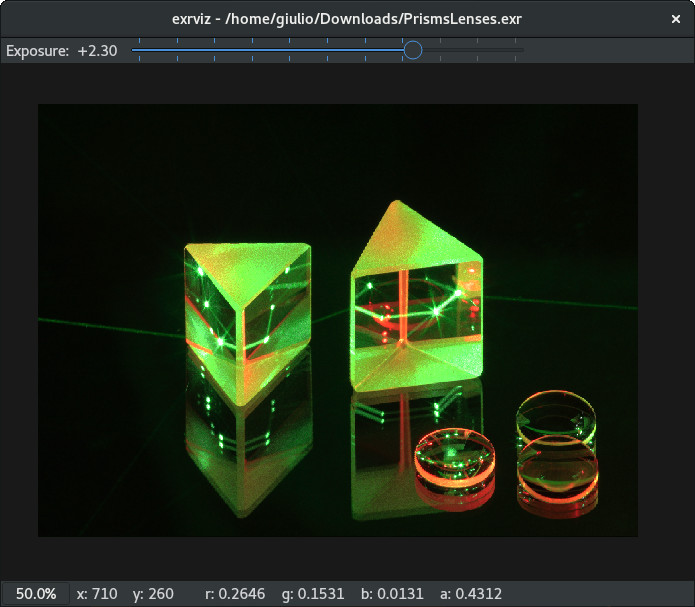
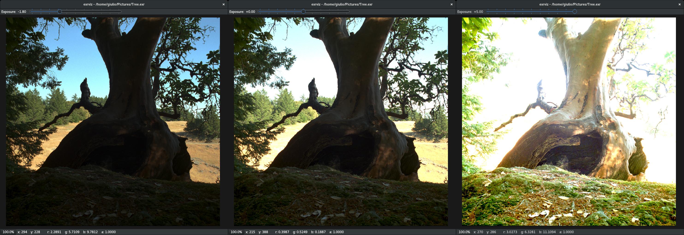
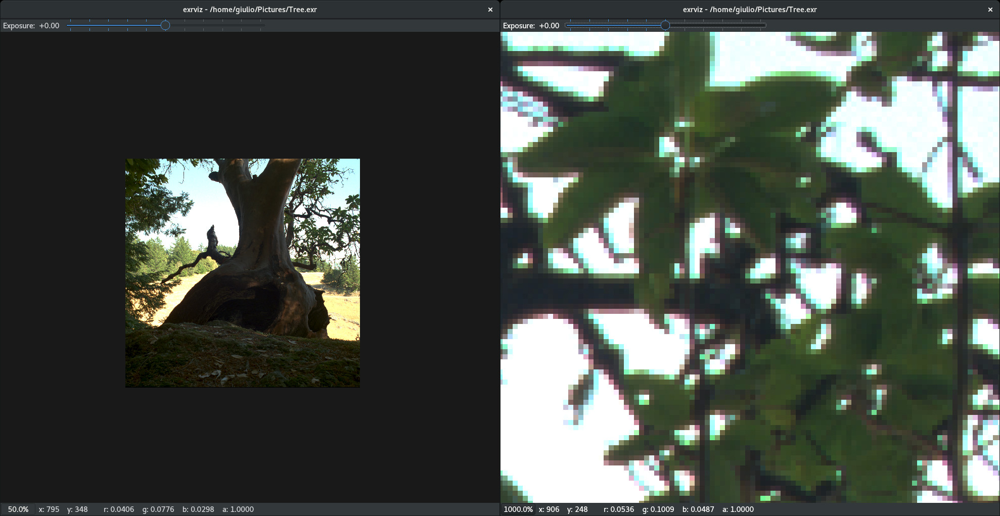

# ExrViz

OpenEXR image visualizer. Written in C++ and Qt5.



### Current features

- OpenEXR files reading and displaying
- Tonemapping of exrdisplay ([http://www.openexr.com/using.html](http://www.openexr.com/using.html))
- Pan and zoom
- Pixel readout

### Planned features

- Gamma slider
- Better style

## Screenshots

The slider in the top bar controls the displayed image exposure.

Mouse drag and wheel control pan and zoom of the image. The button on the bottom bar resets the zoom level.


## How to compile and run

The straightforward compilation works only on a Unix machine where OpenEXR is installed and its header are located in `/usr/include/OpenEXR`:

```
$ qmake -o Makefile exrviz.pro
$ make
```

If the compilation succeds just run:
```
$ bin/exrviz <exr file path>
```
